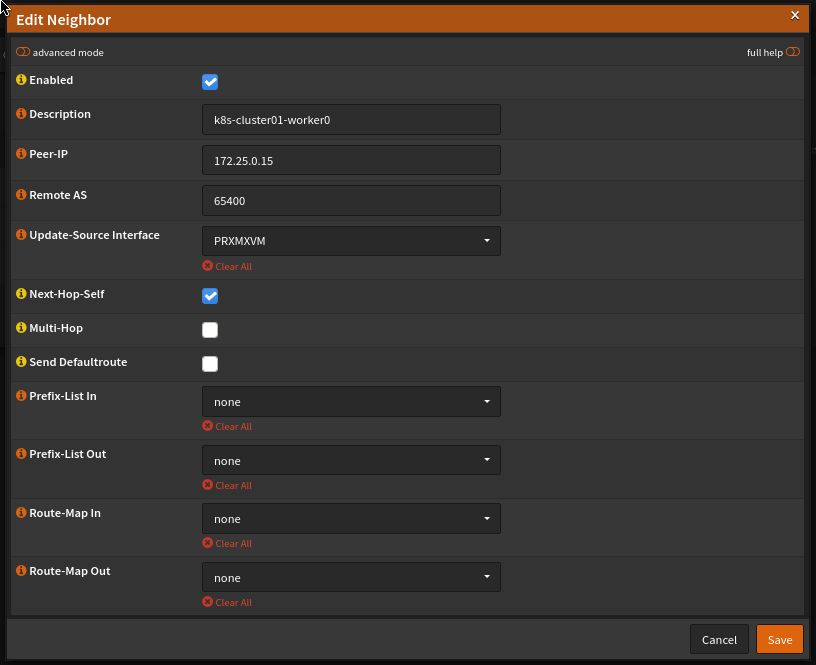
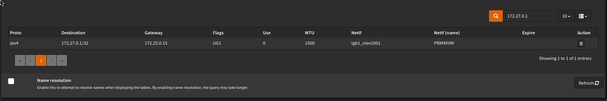
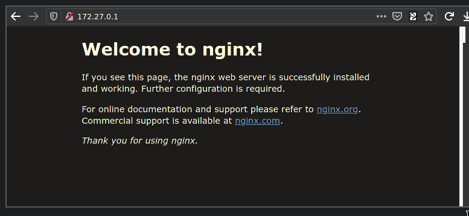

**Update**: Cilium now has a new BGP integration so things have changed a little; see [this post](/posts/update-using-bgp-to-integrate-cilium-with-opnsense/) for more details.

If (like me) you happen to follow the development of the [Cilium](https://cilium.io) CNI plugin for Kubernetes then you'll have seen the recent `1.10` release which included _many_ shiny features. One exciting addition is the ability to announce Service IPs via BGP.

Running Kubernetes in a homelab environment quickly highlights that there are some aspects which are a little lacking when compared to the integration you get from the cloud provider offerings. One of the biggest limitations is the inability to create `Loadbalancer` services to expose ingress controllers and the like. [MetalLB](https://metallb.universe.tf/) has been around for some years now and its aim is to improve this situation by using either ARP or BGP to announce routes to Service IPs inside your cluster(s). This means that you can create `Loadbalancer` Services inside your on-prem (or homelab) network, and it goes a long way towards reducing the friction of running Kubernetes outside of the cloud providers.

Cilium very recently [announced the release](https://cilium.io/blog/2021/05/20/cilium-110) of `1.10` which brings with it a whole host of improvements and additions. Of particular interest to me was the native ability of Cilium to [advertise routes to Service IPs via BGP](https://cilium.io/blog/2021/05/20/cilium-110#bgp-for-loadbalancer-vip). I am already using Cilium with MetalLB, so this would allow me to drop a component and reduce complexity.

I run [OPNsense](https://opnsense.org/) as my firewall/router which has the ability to talk BGP (this requires the `os-frr` plugin to be installed). The remainder of this post is a quick how-to on the specifics of connecting Cilium to OPNsense via BGP - it won't cover unrelated Cilium configuration.

For reference, my Kubernetes nodes are reachable on `172.25.0.x` IPs and the Service IP range will be `172.27.0.0/24` (note that OPNsense doesn't have any interfaces with an IP in the Service IP range already; BGP will be doing all the work to get traffic there).

### OPNsense configuration

First off, head to Routing > General and ensure that `enable` is ticked. Additionally, you can enable logging here in case you need to troubleshoot later on. Next, head to Routing > BGP and ensure `enable` is ticked here too, and enter an [AS](https://en.wikipedia.org/wiki/Autonomous_system_(Internet)) number - this should be in the range 64512-65534 as they are reserved for private use (see the [ASN table](https://en.wikipedia.org/wiki/Autonomous_system_(Internet)#ASN_Table) for more info). You'll also need to pick a second AS number for Cilium to use in the next section.

You can enter the IP range you intend allowing Cilium to announce in the Network field, however this is optional. Providing a value here improves security by ensuring that BGP advertisements outside of this range are ignored by OPNsense, however the value of this is questionable in a homelab environment. It's up to you if you want to set this, but it would be good practise to do so.

Next head to the Neighbours tab and add a BGP neighbour for all worker nodes in your cluster. You can add master nodes here too, but generally they won't be running the workloads you're exposing so you'll be adding additional unnecessary network hops if they accept traffic. For each worker, add the worker's IP and the second AS number you chose earlier and set the Update-Source Interface to the OPNsense interface which faces your cluster. Also, ensure Next-Hop-Self is ticked as this tells OPNsense to use the worker as the next hop to get to the Service IP.

When you're done, each neighbour should look like the following:



### Cilium configuration

Configuration in the cluster is pretty simple and the [BGP docs](https://docs.cilium.io/en/v1.10/gettingstarted/bgp/) are agnostic of the upstream router, so they should cover most use-cases. Assuming you installed Cilium with Helm then you just need to set an additional couple of values during the upgrade (or install) process and create an additional ConfigMap.

Create a ConfigMap in the same namespace as Cilium runs in:

```
apiVersion: v1
kind: ConfigMap
metadata:
  name: bgp-config
  namespace: kube-system
data:
  config.yaml: |
    peers:
      - peer-address: 172.25.0.1
        peer-asn: 65401
        my-asn: 65400
    address-pools:
      - name: default
        protocol: bgp
        addresses:
          - 172.27.0.1-172.27.0.254
```

Customise the following settings to suit your network:

- Set `peer-address` to the IP of the your OPNsense router which faces the cluster.
- `peer-asn` is the AS number configured in OPNsense, and `my-asn` is the second AS number you configured for the BGP neighbours
- Set `addresses` to all IP pools you wish to use as Service IPs

When upgrading (or installing) Cilium, ensure that `bgp.enabled=true` and `bgp.announce.loadbalancerIP=true` are set (note that the BGP doc has the wrong key for the loadbalancerIP value).

### Validating your configuration

Follow the [BGP guide](https://docs.cilium.io/en/v1.10/gettingstarted/bgp/#create-loadbalancer-and-backend-pods) to create a deployment and a service. If this is successful, you should see an IP allocated to the Service from your pre-configured address pool:

```
kubectl get svc test-lb
NAME      TYPE           CLUSTER-IP      EXTERNAL-IP   PORT(S)        AGE
test-lb   LoadBalancer   10.104.250.95   172.27.0.1    80:32094/TCP   18h
```

Both successful IP allocation and route advertisement are required for everything to come together. You can check the route tables in OPNsense to see if a route to the External IP was added. In OPNsense, head to System > Routes > Status and enter the Service IP in the filter box (top right). You should see something like the following:



If this has worked, you should be able to access the service from your local machine:



Success!

### Troubleshooting

If this doesn't work, check out the [troubleshooting section](https://docs.cilium.io/en/v1.10/gettingstarted/bgp/#validate-bgp-announcements) of the Cilium docs. Additionally, ensure your firewall rules on the cluster-facing interface allow traffic from other networks through. You should also ensure that OPNsense has a rule to allow BGP communications on the cluster-facing interface (TCP on port 179 in both directions).
